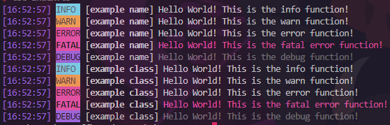

# A simple console logger that has colors.
Rewritten in TypeScript as of 2.0.0.

Shows time, logger name, and some text, with some fancy colors to make it look nice.
Includes info, warn, and error functions, as well as a Logger class.

Example output:



## Standalone function usage
```js
const { info, warn, error } = require('okayulogger');

info("example name", "Hello World! This is the info function!");
warn("example name", "Hello World! This is the warn function!");
error("example name", "Hello World! This is the error function!");
```

## Class usage (recommended)
```js
const { Logger } = require('okayulogger');

let L = new Logger("example name");

L.info("Hello World! This is the info function!");
L.warn("Hello World! This is the warn function!");
L.error("Hello World! This is the error function!");
```
